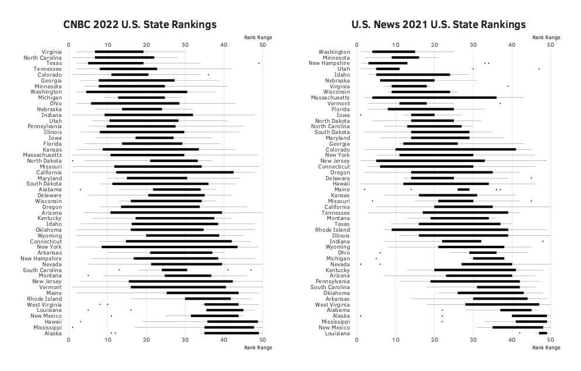

# 2022-cnbc-us-state-ranks

America’s Top States (2022)

Via [CNBC](https://www.cnbc.com/2022/07/13/americas-top-states-for-business-2022-the-full-rankings.html):

>_"To rank America’s Top States for Business in 2022, CNBC scored all 50 states on 88 metrics in 10 broad categories of competitiveness. Each category is weighted based on how frequently states use them as a selling point in economic development marketing materials. That way, our study ranks the states based on the attributes they use to sell themselves. We developed our criteria and metrics in consultation with a diverse array of business and policy experts, and the states. Our study is not an opinion survey. We use data from a variety of sources to measure the states’ performance. Under our [methodology](https://www.cnbc.com/2022/06/13/how-we-are-choosing-americas-top-states-for-business-in-2022.html), states can earn a maximum of 2,500 points. The states with the most are America’s Top States for Business."_

Via [US News]():

>_"Some states shine in health care. Some soar in education. Some excel in both – or in much more. The Best States ranking of U.S. states draws on thousands of data points to measure how well states are performing for their citizens. In addition to health care and education, the metrics take into account a state’s economy, its roads, bridges, internet and other infrastructure, its public safety, the fiscal stability of state government, and the opportunity it affords its residents."_
>
>_"More weight was accorded to some state measures than others, based on a survey of what matters most to people. Health care and education were weighted most heavily. Then came state economies, infrastructure, and the opportunity states offer their citizens. Fiscal stability followed closely in weighting, followed by measures of crime and corrections and a state's natural environment."_
